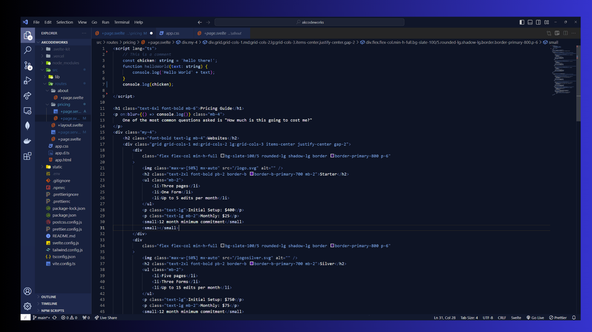

# Deep Sea Blue - VS Code Theme

Dive into the depths of coding with **Deep Sea Blue**, a Visual Studio Code theme that takes you on a serene journey to the mysterious world beneath the ocean's surface. Designed for developers who love the calmness and depth of the deep sea.

## 🌊 Features

- **Rich Blue Hues:** Enjoy a wide range of blue tones, from the light shades of sea foam to the deep, dark blues of the ocean abyss.
- **Underwater Aesthetics:** Elements inspired by the deep sea environment, including subtle gradients and soft highlights that mimic underwater light.
- **Easy on the Eyes:** Carefully selected colors to reduce eye strain during long coding sessions.
- **Syntax Highlighting:** Enhanced readability with clear and distinct colors for syntax highlighting, making it easier to write and review code.
- **Compatibility:** Works great with a wide range of programming languages and file types supported by VS Code.

## 📸 Screenshot

Take a look at Deep Sea Blue in action!

## 🛠 Installation

1. Open **Extensions** sidebar panel in VS Code. `View → Extensions`
2. Search for `Deep Sea Blue`
3. Click **Install**
4. Click **Reload** to reload your editor
5. Code/File → Preferences → Color Theme → **Deep Sea Blue**

## 📝 Feedback

Your feedback and suggestions are very important! If you have any ideas or encounter any issues, please feel free to open an issue in the [GitHub repository]("https:/github.com/agillispie90/deep-sea-blue).

## 📘 License

This theme is open source and available under the MIT License

---

Enjoy coding in the tranquil depths of the ocean with **Deep Sea Blue**!
